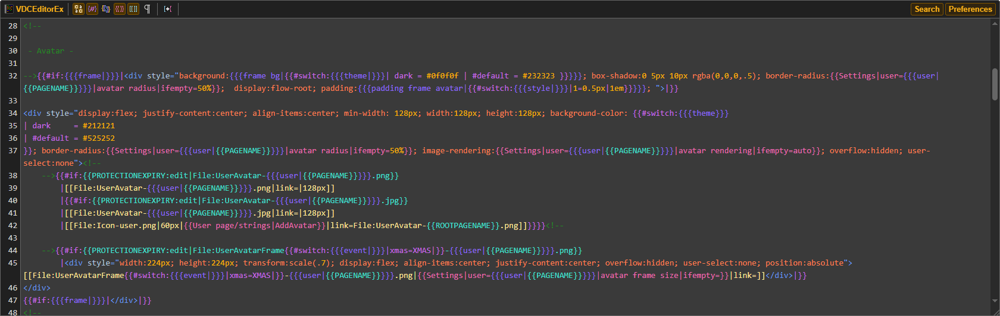
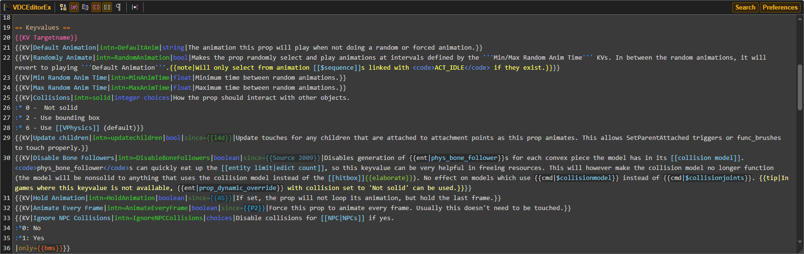
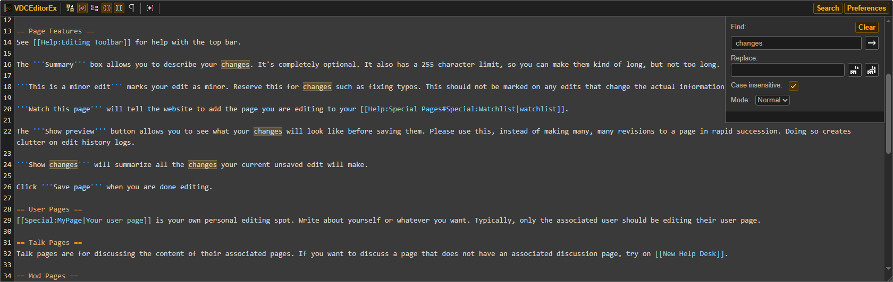
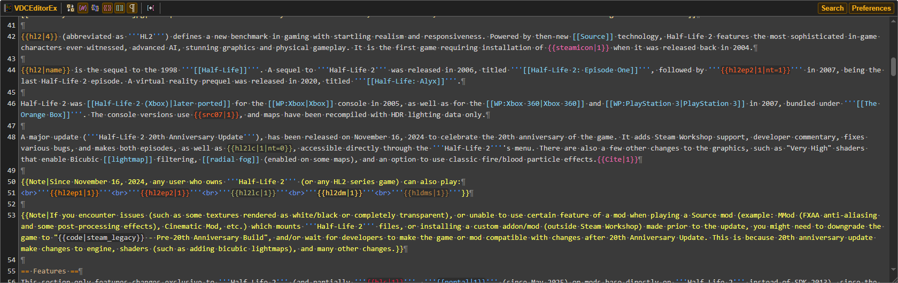
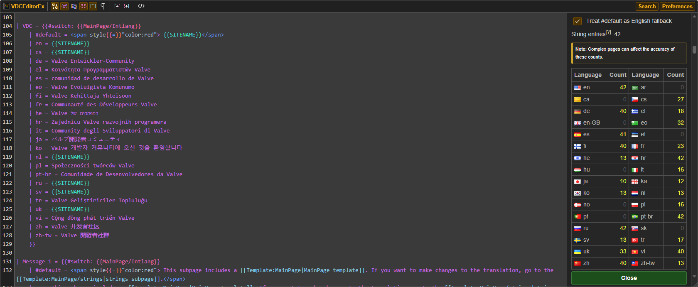
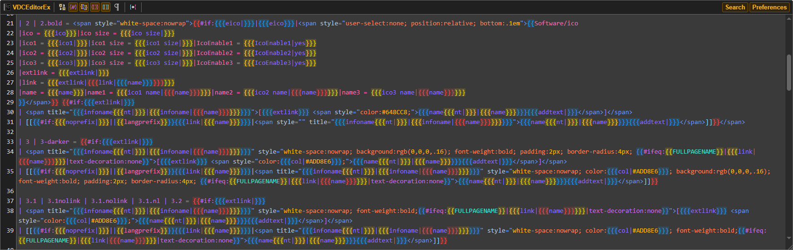

# Valve Developer Community Text Editor Extended v0.1.4

Changes the textarea for editing pages to a more improved version. Designed for the Valve Developer Community site.

**This is a temporary editor, the "Extended" is there to prevent any confusion until v0.2 comes out.**

**This extension may be unstable because it's still under development. 
By installing it, you agree that I (as the creator of this extension) am not responsible for any shortcomings. 
You also agree that you will install the unpacked extension yourself.
This is necessary due to the fact that browsers can block packaged extensions installed not from their store.**

## What's new after v0.1.3

- Added multi bracket colors
- Added Live summary preview
- Added Wiki tabel styling
- Added page strings counter (/strings pages)
- Added Template page opener
	- CTRL + double clicking on the template name in the editor will open a new page (eg. {{Bug|...}})
- Added Multi line tab identation
	- You can now select multiple lines and press tab to indent
- Added a button for changing template links to actual wiki links
- Show invalid HTML tags (Checks for any unclosed html tags)
	- HTML tags inside parser functions like if, switch, etc. will break it if they're included in different blocks
		- Workaround: Use one tag and inside it change what you need
- Moved RTL mode to experimental section
- Fixed broken UDT with nested templates
- Changed the highlight color
- Updated toolbar icons

Some of the templates shown below are custom additions and not part of the editor's built-in styles. For example, templates with dark backgrounds were added separately.
That said, it doesn't mean *I* added them specifically, you can create your own with by going to Preferences -> Templates.

There is a json file called UserDefinedTemplates that in the <code>src/assets</code>, its the main file that has custom templates, use the import button () to add the custom templates.

The editor with custom stylized templates:

