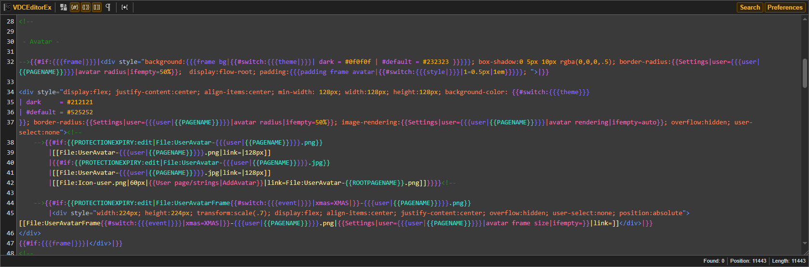
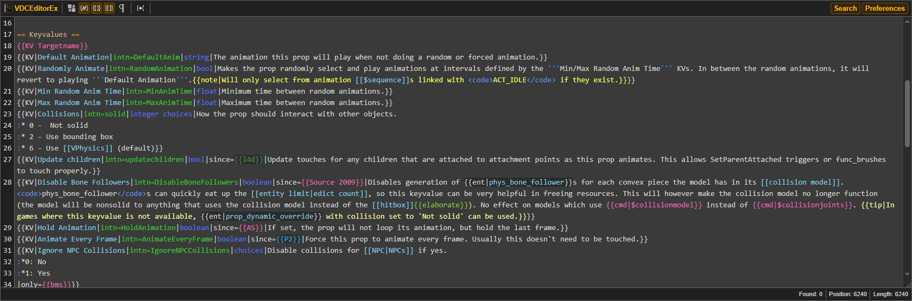
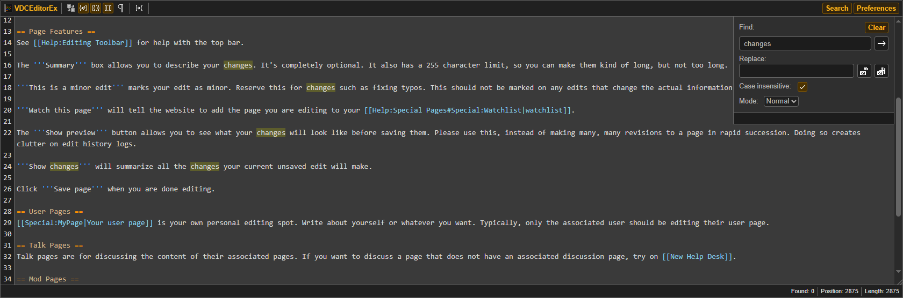
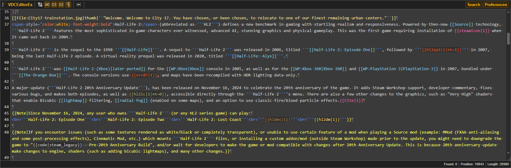

# Valve Developer Community Text Editor Extended v0.1.3

Changes the textarea for editing pages to a more improved version. Designed for the Valve Developer Community site.

**This is a temporary editor, the "Extended" is there to prevent any confusion until v0.2 comes out.**

**This extension may be unstable because it's still under development. 
By installing it, you agree that I (as the creator of this extension) am not responsible for any shortcomings. 
You also agree that you will install the unpacked extension yourself.
This is necessary due to the fact that browsers can block packaged extensions installed not from their store.**

## What's new after v0.1.2

- Added an error window, this is an important change, since any break in the editor may not save any changes
- Added search mode
- Added experimental features; Such as:
	- Live summary preview
	- Wiki table styling
	- string counter (only on /strings pages)
	- Open a new tab with template name (e.g clicking the "Bug"; {{Bug|...}})
	- Show invalid HTML tags (Check for any unclosed html tags)
- Added a Show Hidden Characters button
- Added "markup" style (stylizes "#", ";", ":", "\*" on the start of the line)
- Added a UI to add UDT (User Defined Templates)
	- Renamed templates.js to templates_json.js to only have built-in magic words
- Removed Right to Left mode
	- Buggy, breaks some features, and events don't get the mode
- Fixed HTML tags styling
- Fully supported template nesting and param nesting
- Seperated translations to their repsective json files, see [src/locales/locales.json](VDCEditorEx-v0.1.3/src/locales/locales.json) on how to add a language.

Some of the templates shown below are custom additions and not part of the editor's built-in styles. For example, templates with dark backgrounds were added separately.
That said, it doesn't mean *I* added them specifically, you can create your own with by going to Preferences -> Templates.

There is a json file called UserDefinedTemplates that in the <code>src/assets</code>, its the main file that has custom templates, use the import button () to add the custom templates.

The editor with custom stylized templates:

